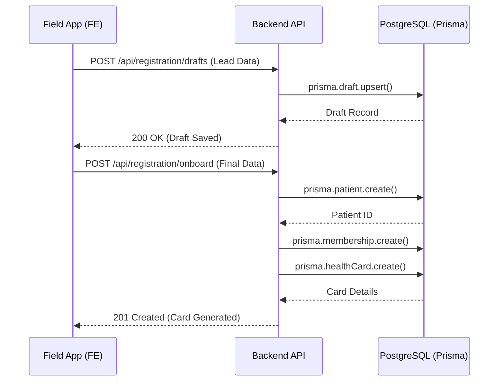
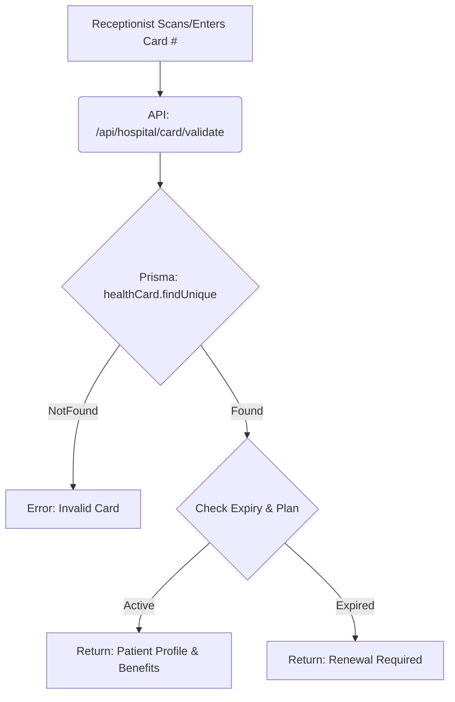

# System Technical Flows
Detailed tracing of user actions from UI to Database.

## 1. Field Executive: Lead to Registration Flow
Tracing the path of onboarding a new member.

| Action | API Endpoint | DB Tables Impacted | Data Processing |
| :--- | :--- | :--- | :--- |
| **Save Lead** | `/registration/drafts` | `Draft` | Serializes JSON form data into storage. |
| **Complete Onboarding**| `/registration/onboard` | `Patient`, `Membership`, `HealthCard` | Validates phone uniqueness, creates relations, generates unique 12-digit card number. |

---

## 2. Hospital: Patient Validation Flow
Tracing the path when a patient visits a hospital.

---

## 3. Analytics: Super Admin Dashboard
Tracing data aggregation.

| View | Source API | Calculation Logic | DB Source |
| :--- | :--- | :--- | :--- |
| **Total Revenue** | `/analytics/overview` | `SUM(payments.amount)` | `Payment` Table |
| **Active Members** | `/analytics/overview` | `COUNT(membership.id) WHERE status='ACTIVE'` | `Membership` Table |
| **Executive Performance**| `/analytics/executives` | `COUNT(registrations) grouped by executiveId` | `Patient` + `User` Tables |
